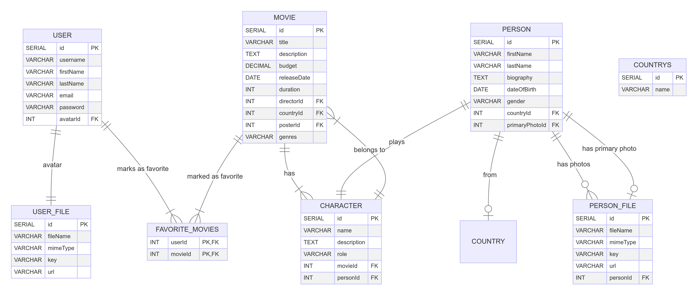

This project involves designing and implementing a simplified database for a movie application. The database stores information about users, movies, characters, and other related entities. The main objective is to manage user profiles, movie details, favorite movies, and character data.

## Database Structure

The database is structured with the following main entities:

- **Users:** Information about the users including their profile details and avatars.
- **Movies:** Contains details about movies, including titles, descriptions, genres, and related metadata.
- **Characters:** Data about characters in movies, their roles, and associated actors.
- **Persons:** Includes data about actors and directors, along with their associated media files.
- **Countries:** Stores country information related to movies and persons.
- **Files:** Used for storing file metadata such as images for user avatars and person photos.
- **Favorite Movies:** Allows users to mark movies as their favorites, storing the list of favorite movies for each user.

## Entity-Relationship Diagram (ERD)

The ER diagram below represents the database structure, showing the entities, their attributes, and the relationships between them.

